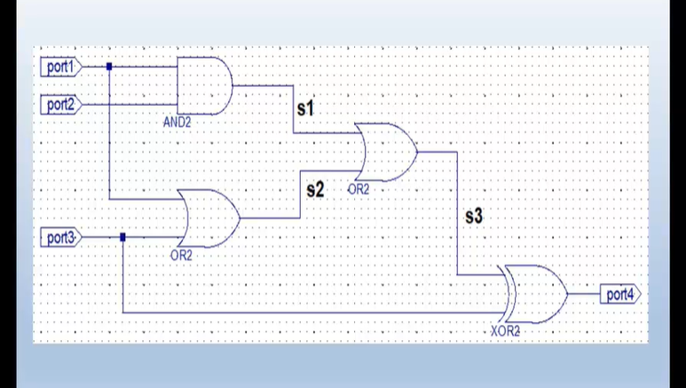

# Digital Logic Circuit Lab 5 - Circuit 2

## Overview
This repository contains the implementation of a digital logic circuit using VHDL in Xilinx ISE. The circuit consists of basic logic gates (AND, OR, XOR) connected to form a specific logical function.

## Circuit Diagram

## Circuit Description
The circuit implements the following logical operations:
- Input ports: port1 (3-bit vector: port1[0], port1[1], port1[2])
- Output port: port2 (1-bit)
- Internal signals: s1, s2, s3

### Logical Operations:
1. s1 = port1[0] AND port1[1]
2. s2 = port1[0] OR port1[2]
3. s3 = s1 OR s2
4. port2 = s3 XOR port1[2]

## Implementation Details
- **Entity Name**: circiut2_rtl
- **Architecture**: Behavioral
- **Files**:
  - `circiut2_rtl.vhd`: Main circuit implementation
  - `circuit2_tb.vhd`: Testbench for verification
  - Various project files for Xilinx ISE

## Project Structure
The project follows standard Xilinx ISE structure with:
- RTL description
- Testbench
- Simulation files
- Project configuration files

## How to Use
1. Open the project in Xilinx ISE using the `lab5_circuit2.xise` file
2. Simulate the design using the testbench
3. Analyze the waveform to verify correct functionality

## Date
Created: May 5, 2025