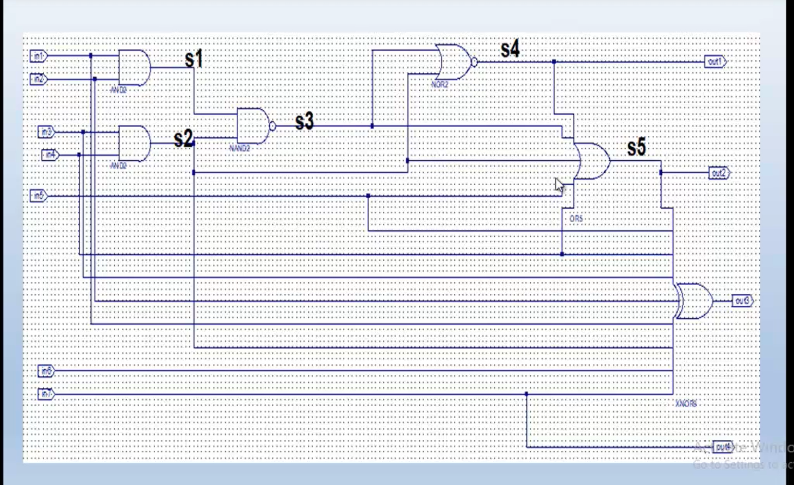

# Digital Logic Circuit Lab 6 - Circuit 3

## Overview
This repository contains the implementation of a complex digital logic circuit using VHDL in Xilinx ISE. The circuit utilizes multiple logic gates (AND, NAND, NOR, OR, XOR) to implement a specific logical function with multiple inputs and outputs.

## Circuit Diagram

## Circuit Description
The circuit implements the following logical operations:
- Input ports: port1 (7-bit vector: port1[1] to port1[7])
- Output ports: port2 (4-bit vector: port2[1] to port2[4])
- Internal signals: s1, s2, s3, s4, s5

### Logical Operations:
1. s1 = port1[1] AND port1[2]
2. s2 = port1[3] AND port1[4]
3. s3 = s1 NAND s2
4. s4 = s3 NOR s2
5. s5 = s4 OR s3 OR s2 OR port1[5] OR port1[4]
6. port2[1] = s4
7. port2[2] = s5
8. port2[3] = s5 XOR port1[5] XOR port1[4] XOR port1[3] XOR port1[2] XOR port1[1] XOR s2 XOR port1[6] XOR port1[7]
9. port2[4] = port1[7]

## Implementation Details
- **Entity Name**: circuit2_rtl
- **Architecture**: Behavioral
- **Files**:
  - `circuit2_rtl.vhd`: Main circuit implementation
  - `circuit3_tb.vhd`: Testbench for verification
  - Various project files for Xilinx ISE

## Project Structure
The project follows standard Xilinx ISE structure with:
- RTL description
- Testbench
- Simulation files
- Project configuration files

## How to Use
1. Open the project in Xilinx ISE using the `lab6_circuit3.xise` file
2. Simulate the design using the testbench
3. Analyze the waveform to verify correct functionality

## Date
Created: May 5, 2025