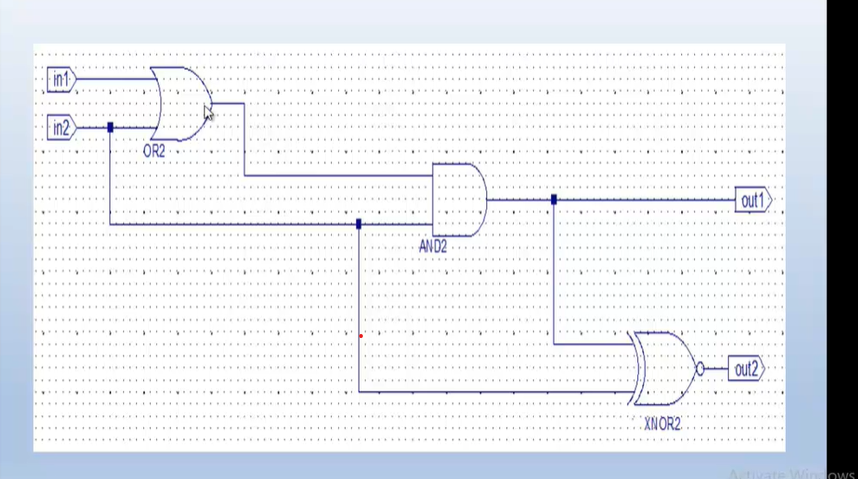

# Digital Logic Circuit 1 - Lab 7

This repository contains the implementation of a digital logic circuit designed and simulated in Xilinx ISE. The circuit demonstrates the use of OR, AND, and XNOR gates in a specific configuration.

## Circuit Schematic

### Circuit Description
This circuit implements a logic function with:
- Two inputs: in1 and in2
- Two outputs: out1 and out2
- The following components:
  - OR2 gate that takes in1 and in2 as inputs
  - AND2 gate that combines the OR2 output with in2
  - XNOR2 gate that produces out2

### Truth Table
| in1 | in2 | out1 | out2 |
|-----|-----|------|------|
| 0   | 0   | 0    | 1    |
| 0   | 1   | 1    | 0    |
| 1   | 0   | 0    | 0    |
| 1   | 1   | 1    | 1    |

### Implementation Files
- `circuit1_sch.sch`: Schematic file for the circuit
- `circuit1_sch.vhf`: VHDL file generated from the schematic
- `circuit1_tb.vhd`: Testbench for circuit verification
- `and_rtl.vhd`: Implementation of AND gate
- `or_rtl.vhd`: Implementation of OR gate
- `xnor_rtl.vhd`: Implementation of XNOR gate

## How to Use This Project
1. Open the `lab7_circuit1_schematic.xise` project file in Xilinx ISE Design Suite
2. To view the schematic, open the `circuit1_sch.sch` file
3. To simulate, run the testbench (`circuit1_tb.vhd`)
4. To synthesize, select the top-level module and run synthesis

## Logic Analysis
The circuit implements the following logic:
- out1 = (in1 OR in2) AND in2
- out2 = XNOR of inputs to the gate

This design demonstrates basic logic gate combinations and how they can be used to implement specific boolean functions.

## Verification
The circuit has been verified through simulation using the provided testbench. The simulation confirms that the circuit behaves according to the expected truth table.
