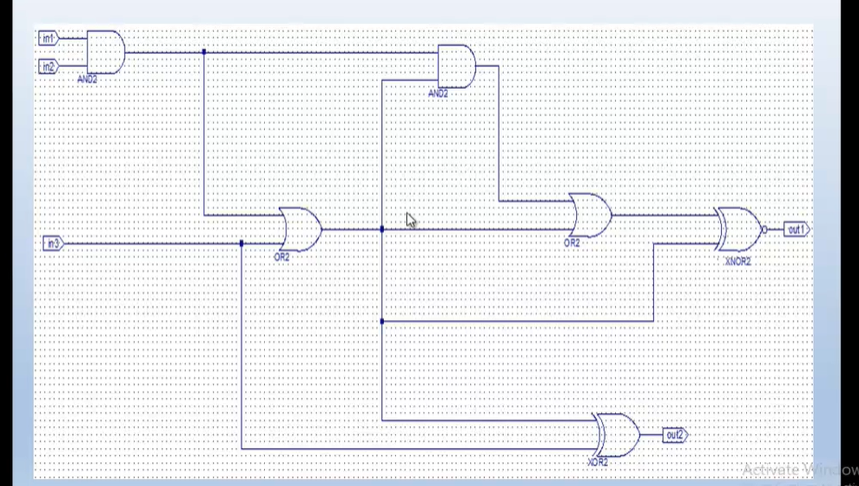

# Digital Logic Circuit 2 - Lab 8

This repository contains the implementation of a more complex digital logic circuit designed and simulated in Xilinx ISE. The circuit demonstrates the use of AND, OR, XOR, and XNOR gates in a more advanced configuration.

## Circuit Schematic

### Circuit Description
This circuit implements a multi-input, multi-output logic function with:
- Three inputs: in1, in2, and in3
- Two outputs: out1 and out2
- The following components:
  - AND gate
  - Multiple OR gates in specific configuration
  - XOR and XNOR gates

### Truth Table
| in1 | in2 | in3 | out1 | out2 |
|-----|-----|-----|------|------|
| 0   | 0   | 0   | 0    | 0    |
| 0   | 0   | 1   | 1    | 0    |
| 0   | 1   | 0   | 0    | 0    |
| 0   | 1   | 1   | 1    | 1    |
| 1   | 0   | 0   | 0    | 0    |
| 1   | 0   | 1   | 1    | 1    |
| 1   | 1   | 0   | 1    | 0    |
| 1   | 1   | 1   | 1    | 1    |

### Implementation Files
- `circuit2_sch.sch`: Schematic file for the circuit
- `circuit2_sch.vhf`: VHDL file generated from the schematic
- `circuit2_sch_tb.vhd`: Testbench for circuit verification
- `and_trl.vhd`: Implementation of AND gate
- `or_rtl.vhd`: Implementation of OR gate
- `xor_rtl.vhd`: Implementation of XOR gate
- `xnor_rtl.vhd`: Implementation of XNOR gate

## How to Use This Project
1. Open the `lab8_circuit2_schematic.xise` project file in Xilinx ISE Design Suite
2. To view the schematic, open the `circuit2_sch.sch` file
3. To simulate, run the testbench (`circuit2_sch_tb.vhd`)
4. To synthesize, select the top-level module and run synthesis

## Logic Analysis
This circuit demonstrates:
- Parallel logic paths
- How cascaded gates can implement more complex boolean functions
- Signal distribution to multiple gate inputs
- Combination of different gate types to achieve desired functionality

## Verification
The circuit has been verified through simulation using the provided testbench. The simulation confirms that the circuit behaves according to the expected truth table.

## Applications
This type of circuit could be used in:
- Binary decoders
- Data selectors
- Priority encoders
- Parts of more complex digital systems
